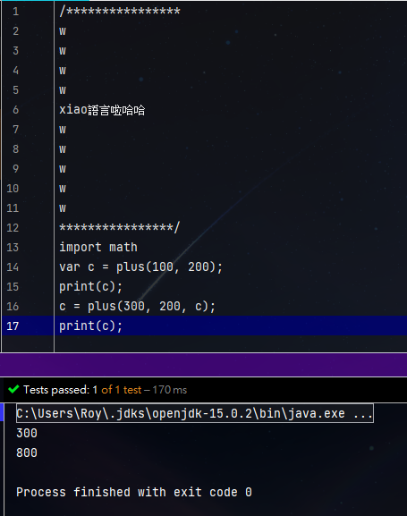
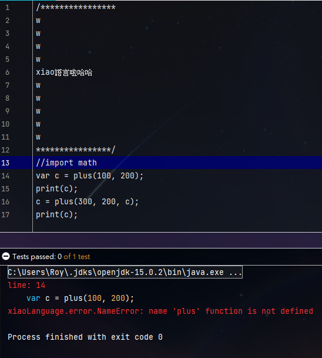
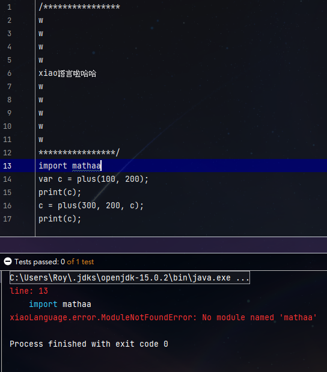

:::details Code
```
/****************
w
w
w
w
xiao語言啦哈哈
w
w
w
w
w
****************/
import math
var c = plus(100, 200);
print(c);
c = plus(300, 200, c);
print(c);
```
:::

:::tip Output
```
300
800
```



:::

:::tip 心得
新增了import這樣內建函式就不會太多ㄌ用到時在import那包近來 <br>
那就繼續往下寫摟~~

:::

