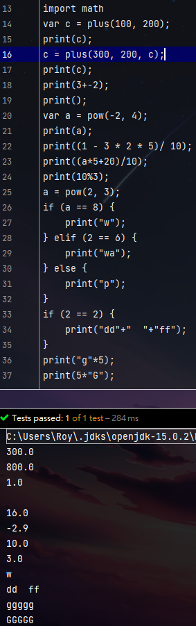

:::details Code
```
import math
var c = plus(100, 200);
print(c);
c = plus(300, 200, c);
print(c);
print(3+-2);
print();
var a = pow(-2, 4);
print(a);
print((1 - 3 * 2 * 5)/ 10);
print((a*5+20)/10);
print(10%3);
a = pow(2, 3);
if (a == 8) {
    print("w");
} elif (2 == 6) {
    print("wa");
} else {
    print("p");
}
if (2 == 2) {
    print("dd"+"  "+"ff");
}
print("g"*5);
print(5*"G");
```
:::

:::tip Output
```
300.0
800.0
1.0

16.0
-2.9
10.0
3.0
w
dd  ff
ggggg
GGGGG
```

:::

:::tip 心得
這次文章拖得比較久齁原因大概就是跑去玩遊戲xiaoLanguage進度拖到，玩了幾天後我又馬上跳回來繼續趕工ㄌ呵呵，那最近把if elif else等等的東西搞出來了，順便幫加上String的運算式
現在String可以相加跟乘與整數，還順便修正了幾個之前的Bug，if elif else我卡了一陣子再想他到底要怎麼寫才能達到我要的結果想了很久就建了底下的樹
```
                IfNode
                  /\
                 /  \
                /    \
               /      \
              /        \
            else     if list
             /\        /|\
            /  \      / | \
           /    \    ..... \
          /      \          \
    judgment    nodes       if
                            /\ 
                           /  \
                     judgment  nodes

```
大概長這樣...的部分是那裡分支都長那樣最後完成並成功時我非常興奮  

:::