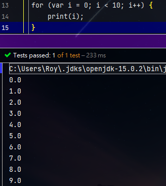

:::details Code
```
for (var i = 0; i < 10; i++) {
    print(i);
}
```
:::

:::tip Output
```
0.0
1.0
2.0
3.0
4.0
5.0
6.0
7.0
8.0
9.0
```

:::

:::tip 心得
終於把for寫出來了不錯不錯for寫的比較順沒有卡關接著我先去碰其他東西xiaoLanguage目前會往後排最近都不會寫ㄌ。
:::