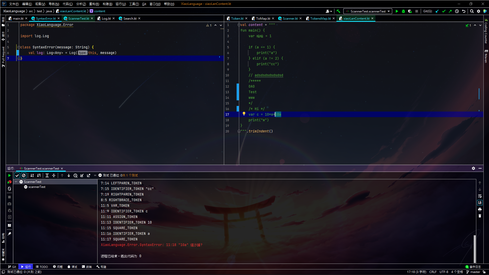

## Code
```
fun main() {
    var 哈哈 = 1
    
    if (a == 1) {
        print("a")
    } elif (a != 2) {
        print("cc")
    }
    // adsdsdsdsdsdsd
    /*****
    OAO
    Test
    www
    */
    /* Hi */
    var c = 10*a*10a
    print("w")
}
```
## Output

....... <br />
<span style="color:red">XiaoLanguage.Error.SyntaxError: 11:18 "10a" 這沙誵?</span>



## 心得
我絕對不會說這個錯誤提示真的很難看，
算了以後再慢慢改，真正的邁向Parser前進!!

### [GitHub](https://github.com/xiaoxigua-1/XiaoLanguage)