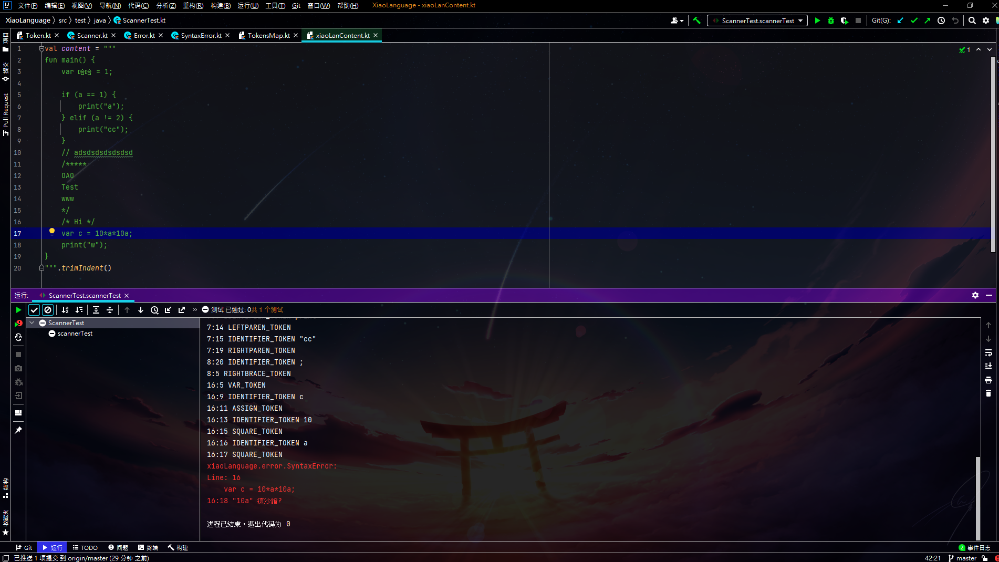

::: details Code
``` {16}
fun main() {
    var 哈哈 = 1;
    
    if (a == 1) {
        print("a");
    } elif (a != 2) {
        print("cc");
    }
    // adsdsdsdsdsdsd
    /*****
    OAO
    Test
    www
    */
    /* Hi */
    var c = 10*a*10a;
    print("w");
}
```
:::

:::danger Output

<code style="color:red;background-color:rgba(0,0,0,0);">
....... <br>
xiaoLanguage.error.SyntaxError: <br>
Line: 16 <br>
<code style="margin-left: 20px;color:red;background-color:rgba(0,0,0,0);">var c = 10\*a\*10a;</code><br>
16:18 "10a" 這沙誵?<br>
</code>


:::


:::tip 心得
繼上次的錯誤很醜所以我稍微改了一下比較好看了吧?<br>
好了別幹話了繼續向Parser前進!!(484說了好幾天)
:::
::: right
[GitHub](https://github.com/xiaoxigua-1/XiaoLanguage)
:::
