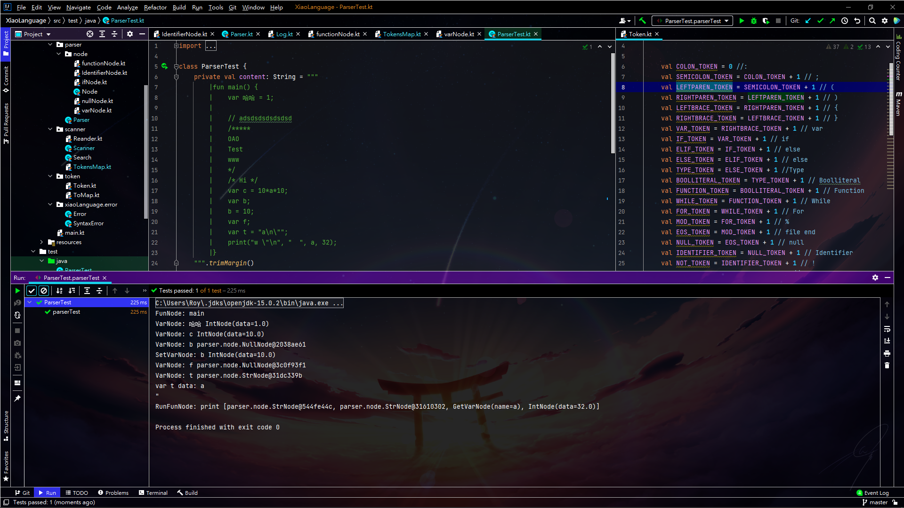
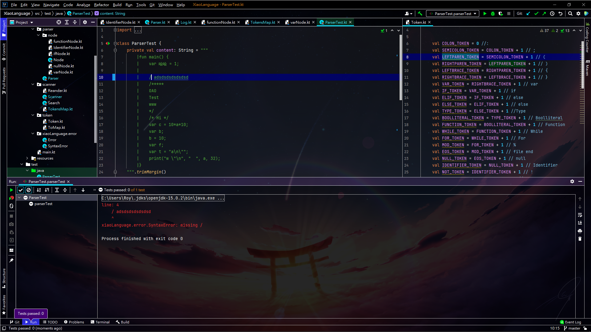
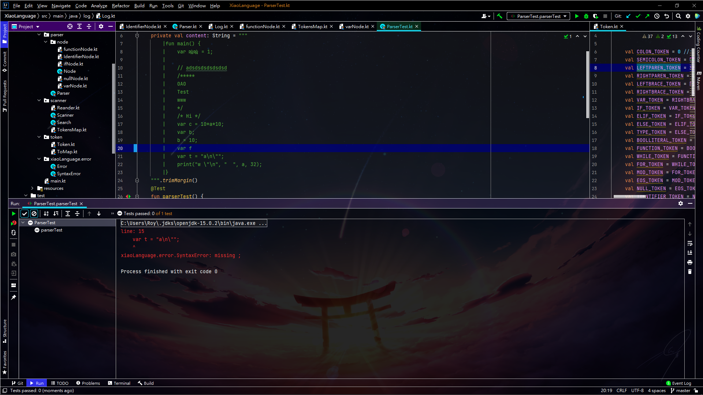
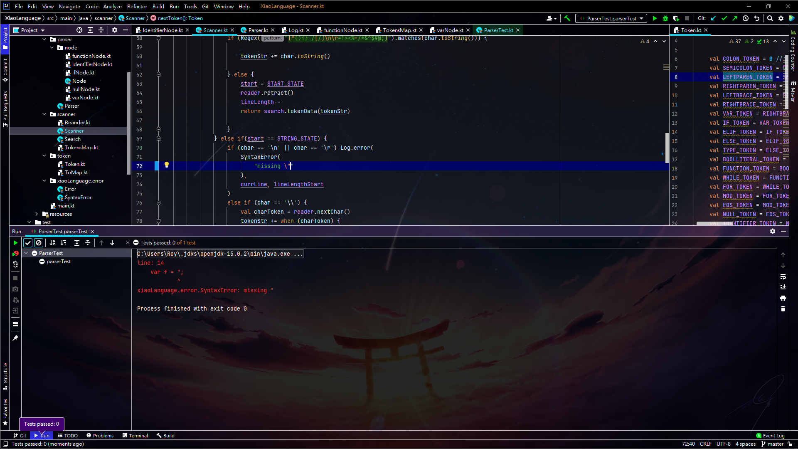
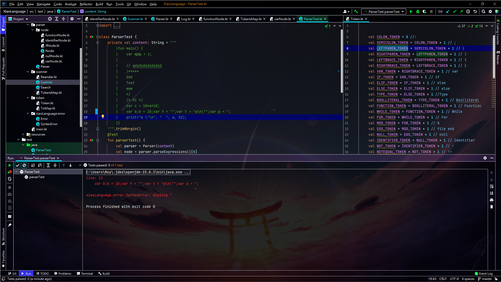

::: details Code
```
fun main() {
    var 哈哈 = 1;
    

    // adsdsdsdsdsdsd
    /*****
    OAO
    Test
    www
    */
    /* Hi */
    var c = 10*a*10;
    var b;
    var f;
    print("w");
}

```
:::

:::tip Output
還沒寫四則運算所以有些地方的資料可能會比較奇怪

:::

:::danger 新增的Error提示




:::

:::tip 心得
終於寫Parser寫了一坨東西最後結果只分析了 function 跟 var 還有 string int等等ㄉ東西<br>
還蠻累ㄉ <br>
好了不幹話了繼續寫!!
:::
