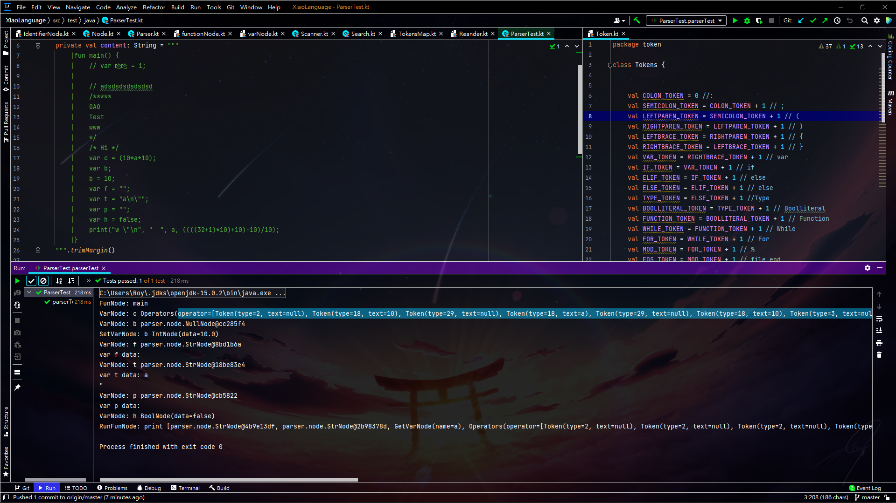
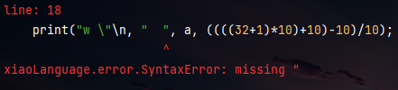
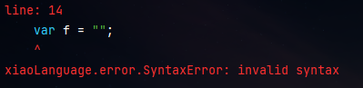

:::details Code
```
fun main() {
    // var 哈哈 = 1;
    
    // adsdsdsdsdsdsd
    /*****
    OAO
    Test
    www
    */
    /* Hi */
    var c = (10*a*10);
    var b;
    b = 10;
    var f = "";
    var t = "a\n\"";
    var p = ""; 
    var h = false;
    print("w \"\n", "  ", a, ((((32+1)*10)+10)-10)/10);
}
```
:::

:::tip Output
```
FunNode: main
VarNode: c Operators(operator=[Token(type=2, text=null), Token(type=18, text=10), Token(type=29, text=null), Token(type=18, text=a), Token(type=29, text=null), Token(type=18, text=10), Token(type=3, text=null)]) 
VarNode: b parser.node.NullNode@cc285f4
SetVarNode: b IntNode(data=10.0)
VarNode: f parser.node.StrNode@8bd1b6a
var f data: 
VarNode: t parser.node.StrNode@18be83e4
var t data: a
"
VarNode: p parser.node.StrNode@cb5822
var p data: 
VarNode: h BoolNode(data=false)
RunFunNode: print [parser.node.StrNode@4b9e13df, parser.node.StrNode@2b98378d, GetVarNode(name=a), Operators(operator=[Token(type=2, text=null), Token(type=2, text=null), Token(type=2, text=null), Token(type=2, text=null), Token(type=18, text=32), Token(type=26, text=null), Token(type=18, text=1), Token(type=3, text=null), Token(type=29, text=null), Token(type=18, text=10), Token(type=3, text=null), Token(type=26, text=null), Token(type=18, text=10), Token(type=3, text=null), Token(type=25, text=null), Token(type=18, text=10), Token(type=3, text=null)]), parser.node.NullNode@475530b9, IntNode(data=10.0)]
```


:::

:::tip 心得
運算子還沒有建樹只是先獨立出來一個Node光這樣我就寫了很久思考了很久跟Debug很久 QQ <br>
然後順便幫錯誤提示訊息的上了點顏色讓他不是單調的紅色到底 <br>
 <br>
 <br>
看來我還太菜了，好那就繼續往下分析摟!!
:::