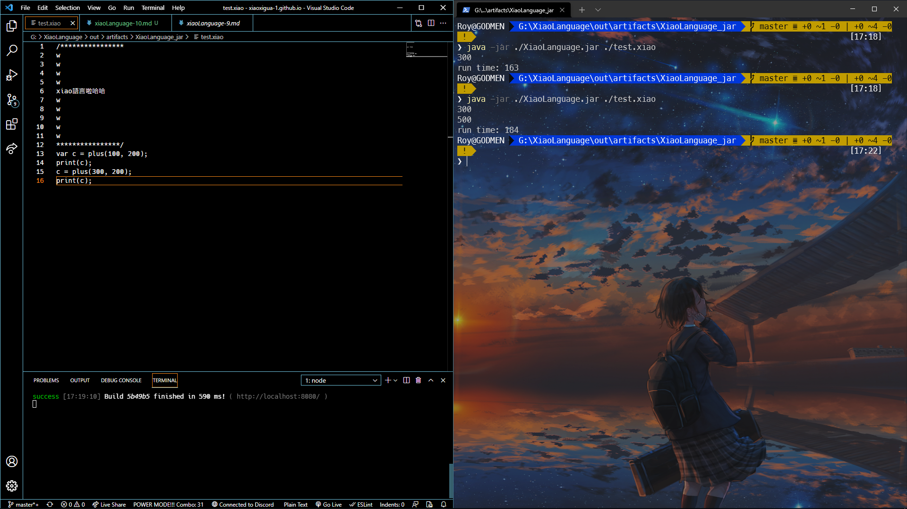
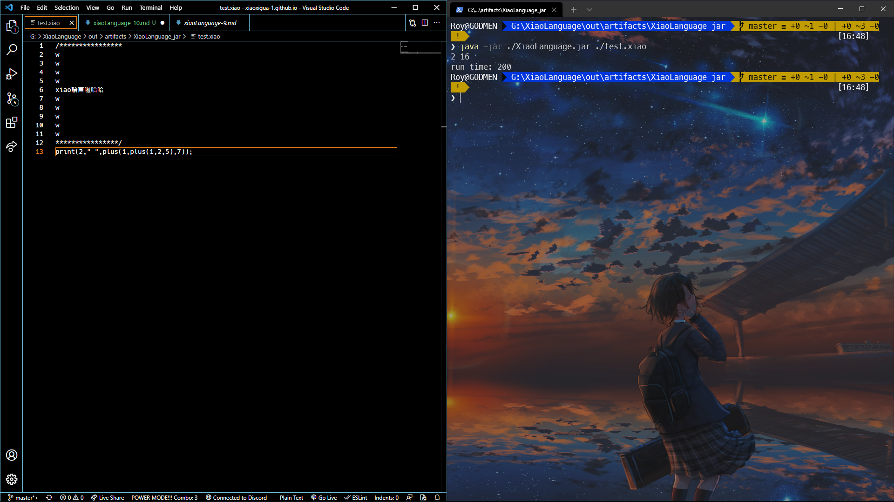
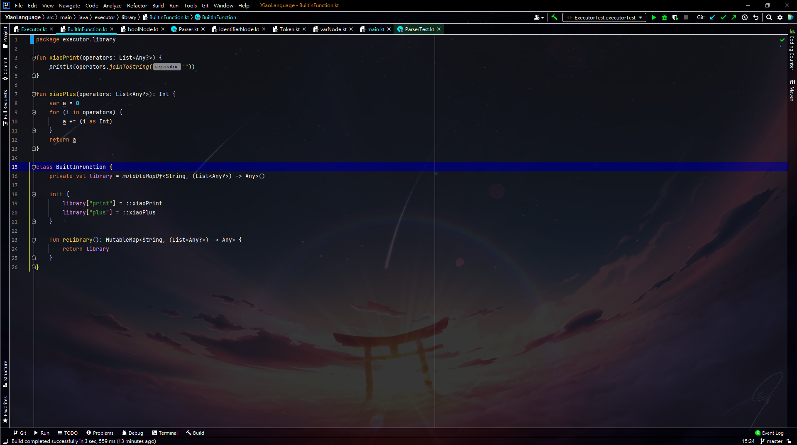

## Code
```
/****************
w
w
w
w
xiao語言啦哈哈
w
w
w
w
w
****************/
print(2," ",plus(1,plus(1,2,5),7));
```

## Output
```
2 16
run time: 200
```



## 心得
新增了Built-in Function <br>

擴充比較容易很棒繼續寫!!