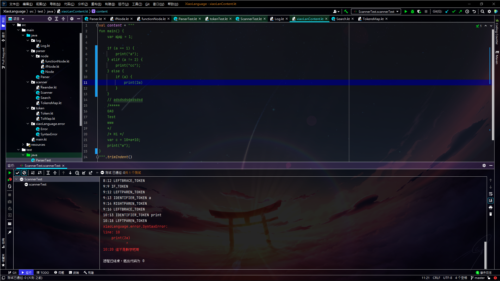
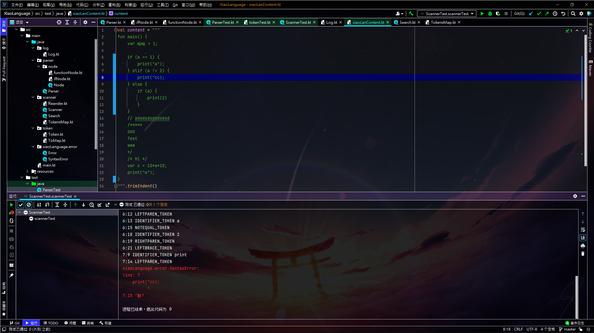

## Code
``` {16}
fun main() {
    var 哈哈 = 1;
    
    if (a == 1) {
        print("a");
    } elif (a != 2) {
        print("cc");
    } else {
        if (a) {
            print(2a)
        }
    }
    // adsdsdsdsdsdsd
    /*****
    OAO
    Test
    www
    */
    /* Hi */
    var c = 10*a*10;
    print("w");
}
```

## Output
<code style="color:red;background-color:rgba(0,0,0,0);">
....... <br>
xiaoLanguage.error.SyntaxError: <br>
Line: 16 <br>
<code style="margin-left: 20px;color:red;background-color:rgba(0,0,0,0);">var c = 10*a*10a;</code><br>
<code style="margin-left: 120px;color:red;background-color:rgba(0,0,0,0);">^</code><br>
10:20 這不是數字吧哥<br>
</code>




## 心得
多了點提示有一個箭頭應該比較好知道哪裡吧?應該
額這是第幾次說要向Parser前進了🤔好啦不管了再說一次<br>
向Parser前進!!<br>
~~雖然有在寫了~~